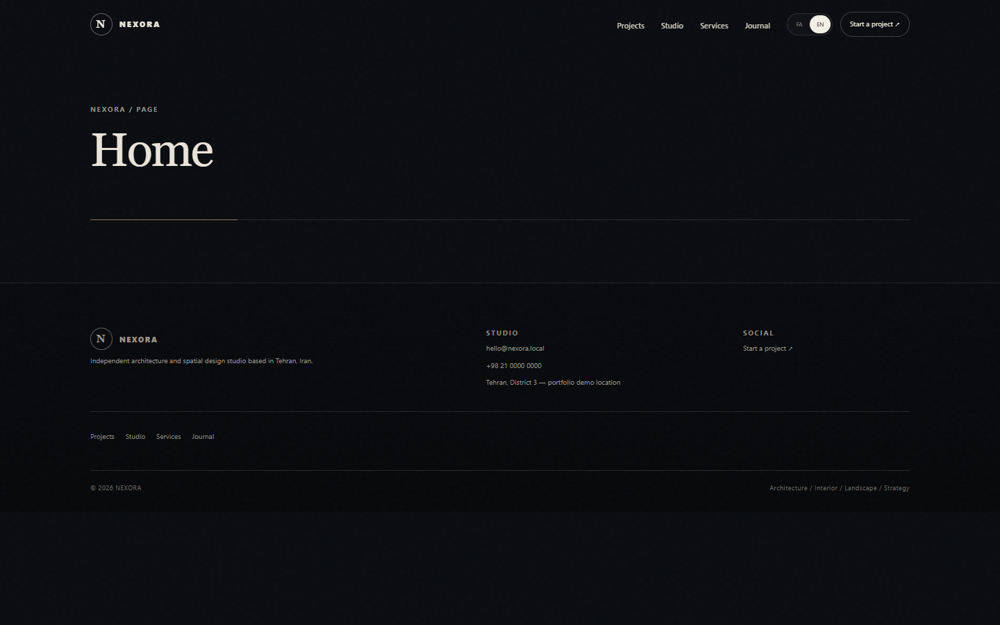
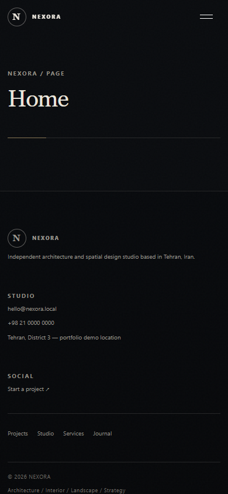
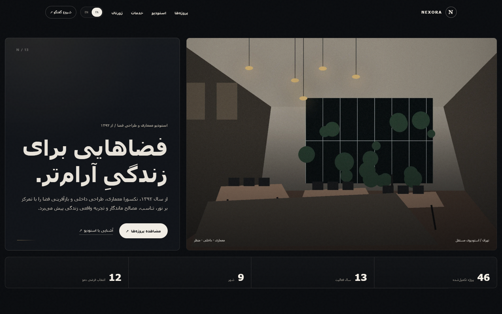
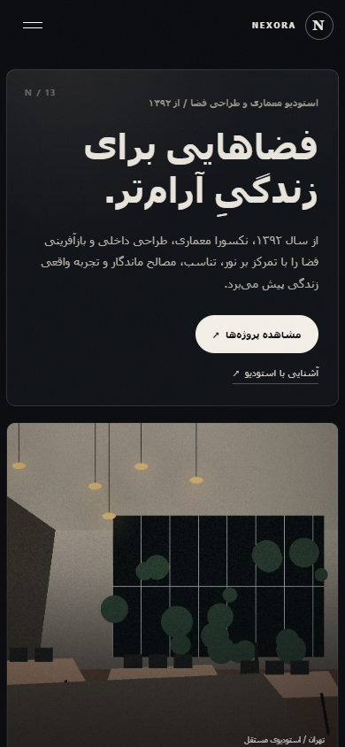
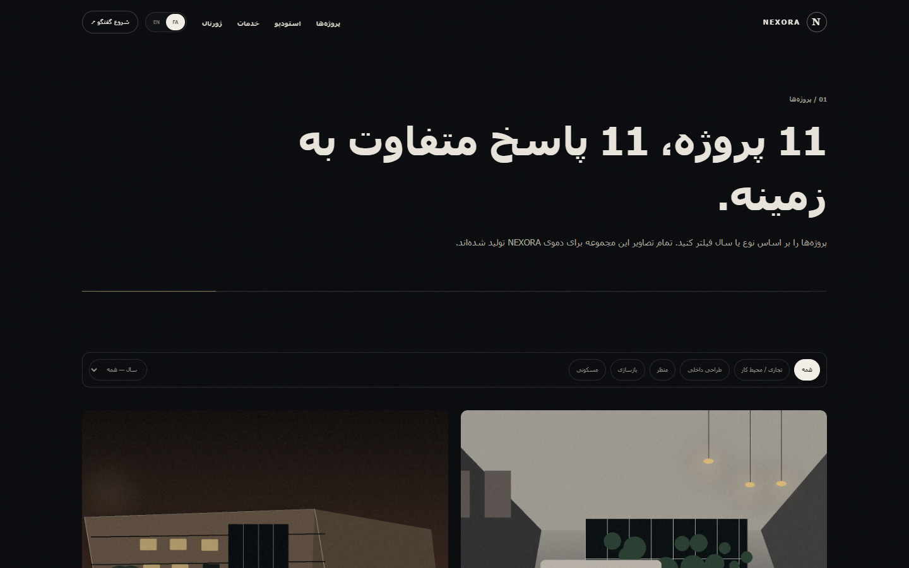
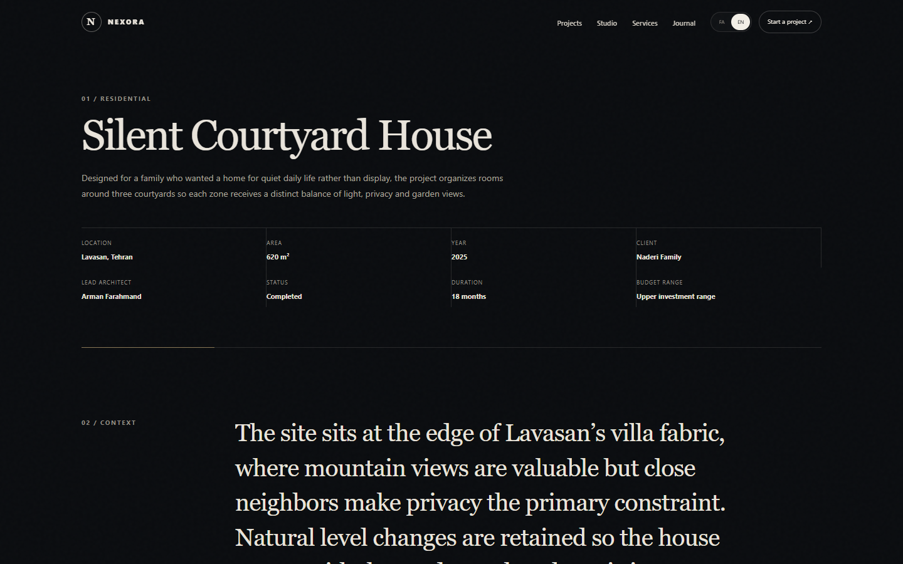
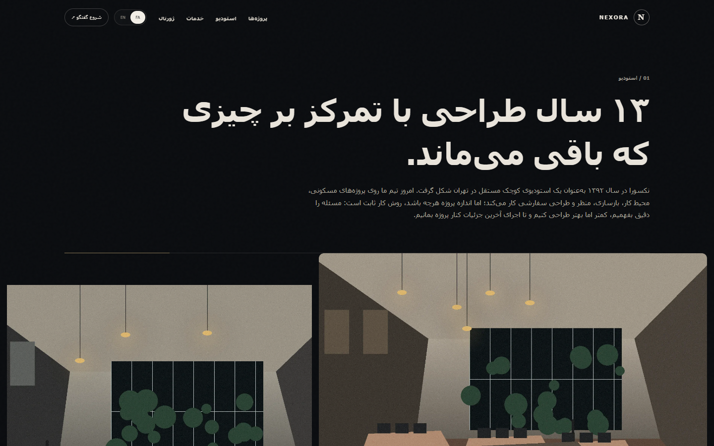
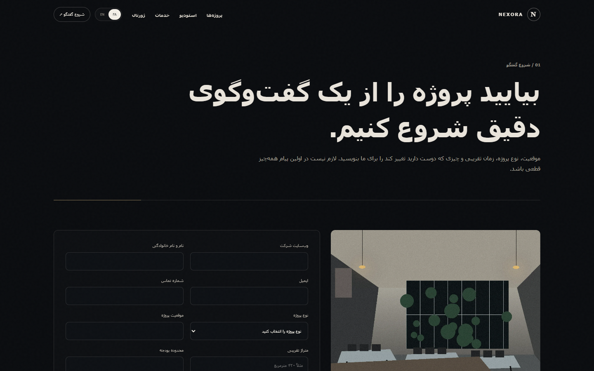
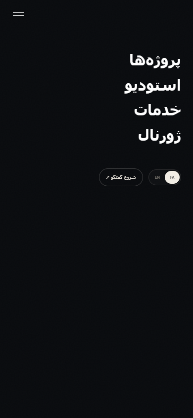
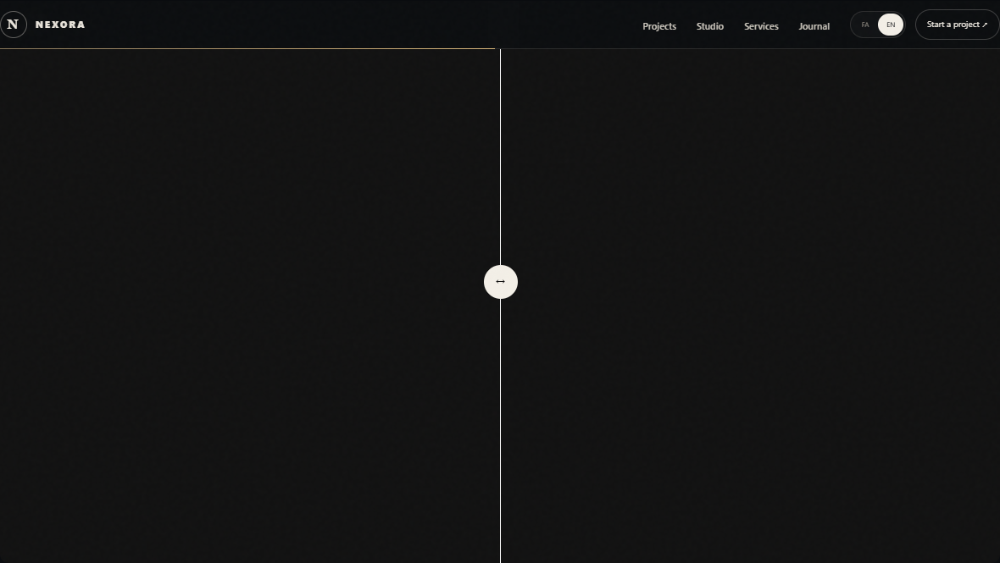

# NEXORA — استودیوی معماری دوزبانه

> یک پورتفولیوی پریمیوم و ادیتوریال WordPress برای استودیوی معماری و طراحی فضا؛ با تجربهٔ مستقل فارسی (RTL) و انگلیسی (LTR) بر پایهٔ Polylang.

[English version](README.md) · [گزارش Visual QA](docs/VISUAL-QA-FINAL.md)

## ویژگی‌ها

- تجربهٔ مستقل فارسی و انگلیسی با RTL و LTR واقعی
- آرشیو پروژهٔ ادیتوریال، فیلتر، Case Study، گالری و مقایسهٔ قبل/بعد
- صفحات استودیو، خدمات، ژورنال، جست‌وجو و فرم درخواست با اعتبارسنجی
- طراحی واکنش‌گرا برای Desktop، Tablet و Mobile
- تعامل‌های سبک و کنترل‌شده: Reveal با IntersectionObserver، stagger کارت‌ها، hover پروژه، تغییر Header، parallax ظریف و پشتیبانی از reduced motion
- شامل قالب اختصاصی WordPress و افزونهٔ همراه `Nexora Core`

## پیش‌نمایش طراحی

### English

| Desktop | Mobile |
| --- | --- |
|  |  |

### فارسی

| دسکتاپ | موبایل |
| --- | --- |
|  |  |

## بخش‌های منتخب

| پروژه‌ها | Case Study |
| --- | --- |
|  |  |

| استودیو | تماس |
| --- | --- |
|  |  |

| منوی موبایل | قبل / بعد |
| --- | --- |
|  |  |

## ساختار پروژه

```text
wp-content/
├── themes/nexora/       # قالب، templateها، استایل و تعامل‌های فرانت‌اند
└── plugins/nexora-core/ # نوع‌های محتوا، دادهٔ دمو، درخواست‌ها و امکانات مدیریت
docs/
├── showcase/            # screenshotهای واقعی مرورگر برای README
└── VISUAL-QA-FINAL.md   # گزارش Runtime و Visual QA
scripts/                 # ابزارهای محلی Playwright برای Screenshot
```

## راه‌اندازی محلی

1. پروژه را در محیط محلی WordPress قرار دهید؛ برای نمونه `C:\\xampp\\htdocs\\nexora`.
2. دیتابیس محلی WordPress را ایجاد/Import و اتصال آن را در `wp-config.php` تنظیم کنید. این فایل عمداً در Git قرار نمی‌گیرد.
3. قالب **Nexora** و افزونهٔ **Nexora Core** را از بخش مدیریت WordPress فعال کنید.
4. Polylang را فعال و ترجمه‌های فارسی و انگلیسی را تنظیم کنید.
5. سایت را در `http://localhost/nexora/` باز کنید.

## نکات کیفی

گزارش QA همراه پروژه، تست واقعی Chrome در هشت viewport، بررسی overflow واکنش‌گرا، اعتبار مسیرها، فیلتر پروژه و اعتبارسنجی سمت‌کاربر فرم تماس را ثبت می‌کند. همچنین اصلاح‌های Hero reveal، منوی موبایل RTL و favicon را مستند کرده است.

## فناوری‌ها

WordPress · PHP · Polylang · Vanilla JavaScript · CSS Custom Properties · Playwright برای Visual QA محلی

---

طراحی و توسعه برای **NEXORA**.
